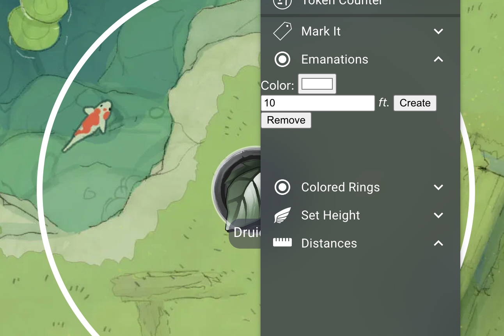

# Emanations

Add emanations to any character. Emanations will automatically resize after tokens are scaled, and will display the correct shape for the current grid measurement type.

## To do
- Display a list of active emanations in the context menu, with 'remove' buttons
- Better styling for context menu
- Better drawing for alternating and manhattan (actually exclude diagonal squares from manhattan, and fix alternating)
- Hexagonal emanations
- Square mode vs accurate mode for chebyshev, alternating
- Better names

## Installing

The extension can be installed from the [store page](https://extensions.owlbear.rodeo/owlbear-emanation).

## How it Works

This project is a simple Typescript app.

The background script `background.ts` communicates with Owlbear Rodeo to create a context menu item. When that item is clicked a popup is shown with the `contextmenu.ts` site rendered.

## Building

This project uses [Yarn](https://yarnpkg.com/) as a package manager.

To install all the dependencies run:

`yarn`

To run in a development mode run:

`yarn dev`

To make a production build run:

`yarn build`

## License

GNU GPLv3
