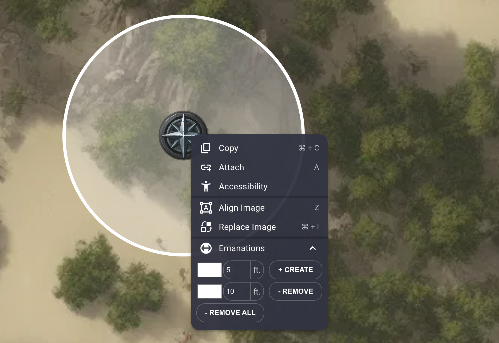

# Emanations

Add emanations to any character.

## Features
- Emanations will display the correct shape for the current grid type and grid measurement type.
- Emanations will automatically resize after tokens are scaled.
- Manage any number of emanations with any color.

### Dragtool
- Drag items around (mobile friendly) to create 'drag sequences' of multiple waypoints, which keep track of how far the item has moved in total.
- Sequences for an item delete if another player moves them
- Sequences for an item delete if their player leaves
- Set the scaling of movement to 2x to simulate 5e difficult terrain, or 0x to simulate teleportation.
- Emanations become sweeps

Font: Acme

## Installing

The extension can be installed from https://owlbear-emanation.pages.dev/manifest.json.

Eventually on [store page](https://extensions.owlbear.rodeo/owlbear-emanation).

## Development

After checkout, run `yarn dlx @yarnpkg/sdks vscode` to set up development in VS Code.

## How it Works

This project is a simple Typescript app.

The background script `background.ts` communicates with Owlbear Rodeo to create a context menu item. When that item is clicked a popup is shown with the `contextmenu.ts` site rendered.

The `action.html` page is rendered as an action item, which controls global settings for emanations.

## Building

This project uses [Yarn](https://yarnpkg.com/) as a package manager.

To install all the dependencies run:

`yarn`

To run in a development mode run:

`yarn dev`

To make a production build run:

`yarn build`

## To do
- Update emanations when image alignment changes
- Debounce rebuilds
- Refocus size after rebuild

### Grabtool
- Key to drop a point at current spot?
- Allow measure on non token
- Make 'clear' action only show up when there are active segments

## License

GNU GPLv3
